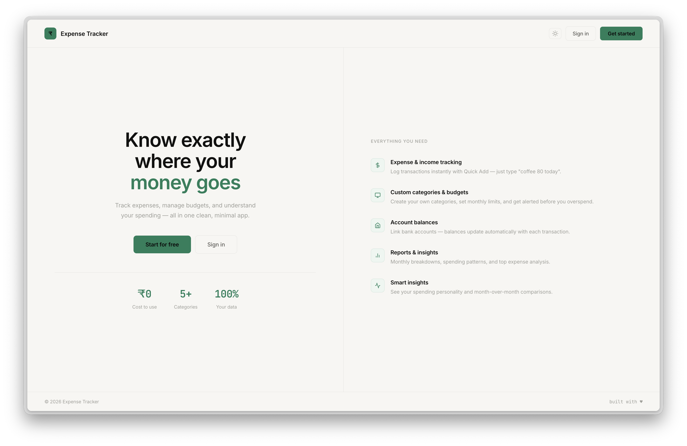
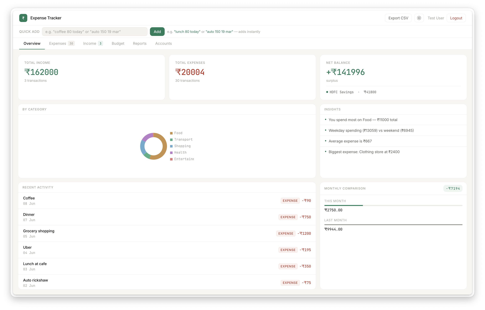
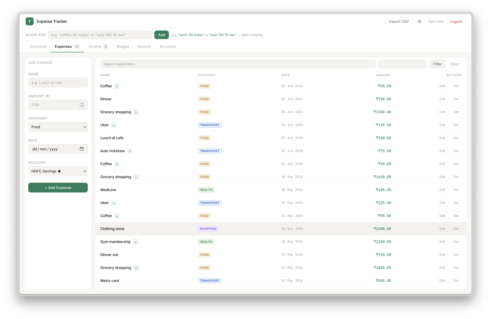
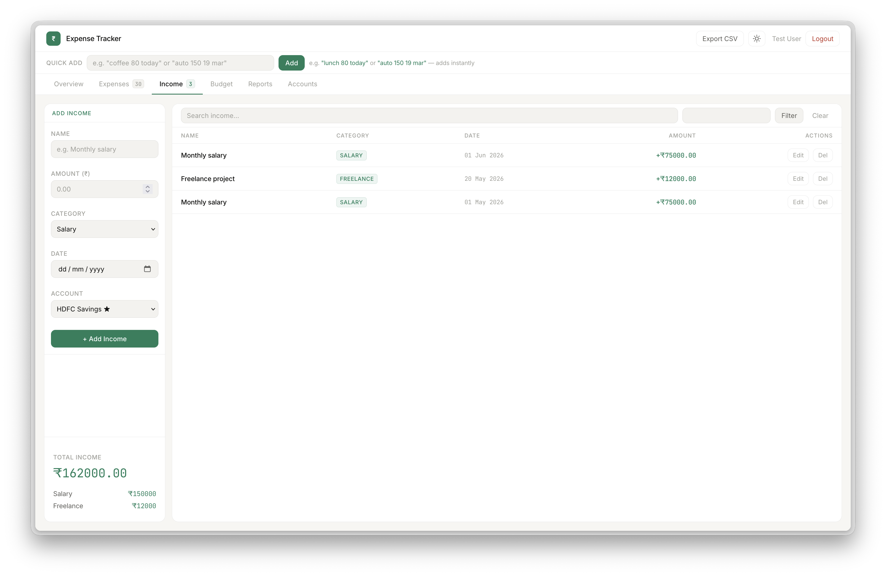
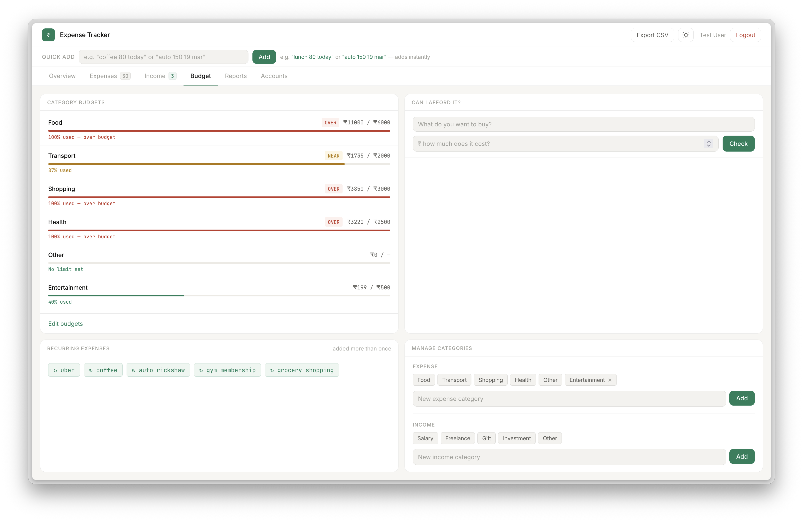
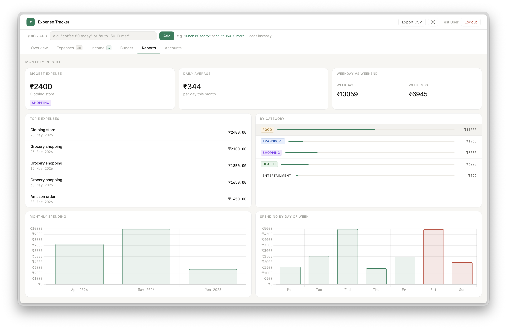
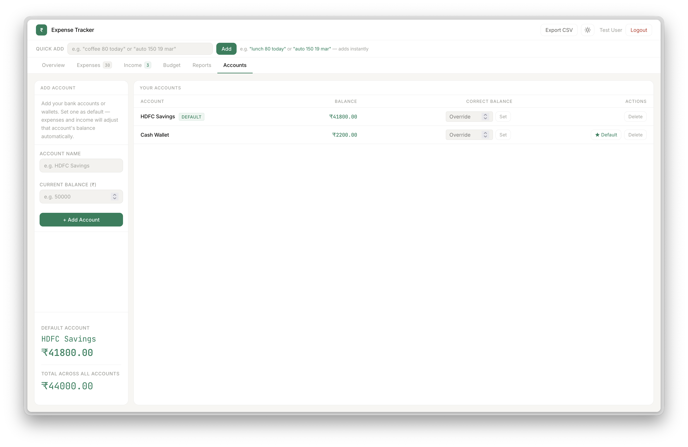

# Expense Tracker

A full-stack personal finance web app built with Python, Flask, and PostgreSQL. Track expenses and income, set category budgets, manage multiple accounts, and get smart spending insights — with a natural language quick-add feature you won't find in most free tools.

**Live demo:** https://expense-tracker-murex-beta-64.vercel.app/

---

## Screenshots

### Landing page


### Overview dashboard


### Expenses


### Income


### Budget & categories


### Reports


### Accounts


---

## Features

### Core
- Add, edit, and delete expenses and income with category tagging
- Filter by month and search by name
- Export all transactions to CSV
- Dark / light theme toggle

### Smart features
- **Natural language input** — type "lunch 80 today" and it adds instantly
- **Smart insights** — weekend vs weekday spending, biggest categories, averages
- **Recurring expense detection** — automatically flags repeated transactions
- **Can I afford it?** — enter a goal amount and get a personalised savings plan

### Categories
- 5 default expense categories and 5 default income categories pre-seeded on signup
- Create your own custom categories for both expenses and income
- All dropdowns, charts, and budgets update automatically

### Budget & reports
- Set monthly budgets per category with visual progress bars
- Over-budget and near-limit alerts
- Monthly comparison (this month vs last month)
- Top 5 expenses, daily average, weekday vs weekend breakdown
- Monthly spending bar chart and day-of-week chart

### Accounts
- Add bank accounts or wallets with a starting balance
- Set a default account — expenses and income adjust its balance automatically
- Total balance shown on the dashboard

### User accounts
- Secure registration and login with a single-viewport landing page
- Passwords hashed with Werkzeug
- Each user's data is completely private
- Persistent sessions with Flask-Login

---

## Tech stack

| Layer | Technology |
|---|---|
| Backend | Python 3, Flask |
| Database | PostgreSQL (Supabase), SQLite (local dev) |
| ORM | Flask-SQLAlchemy |
| Auth | Flask-Login, Werkzeug password hashing |
| Frontend | HTML5, CSS3, Vanilla JavaScript |
| Charts | Chart.js |
| Deployment | Vercel (serverless) + Supabase (PostgreSQL) |
| Version control | Git + GitHub |

---

## Running locally

```bash
# Clone the repo
git clone https://github.com/DhritiVaz/expense-tracker.git
cd expense-tracker

# Create virtual environment
python -m venv .venv
source .venv/bin/activate       # Mac/Linux
.venv\Scripts\activate          # Windows

# Install dependencies
pip install -r requirements.txt

# Run the app
python app.py
```

Open [http://localhost:5001](http://localhost:5001) in your browser.

By default it uses SQLite locally. To connect to a PostgreSQL database instead, create a `.env` file:

```
DATABASE_URL=postgresql://...
SECRET_KEY=your-secret-key
```

---

## Project structure

```
expense-tracker/
├── app.py              # Flask app, routes, database models
├── templates/
│   ├── index.html      # Main dashboard (Overview, Expenses, Budget, Reports, Accounts tabs)
│   ├── landing.html    # Public landing page
│   ├── login.html      # Login page
│   ├── register.html   # Registration page
│   └── edit.html       # Edit transaction page
├── static/
│   └── style.css       # All styling, dark/light theme variables
├── requirements.txt    # Python dependencies
└── vercel.json         # Vercel deployment config
```

---

## What I learned building this

- Full-stack web development with Flask and Jinja2 templating
- Relational database design with SQLAlchemy ORM
- User authentication with password hashing and session management
- Deploying a Python web app to production (Vercel serverless + Supabase PostgreSQL)
- Debugging connection issues between Vercel and Supabase (port restrictions, URL encoding)
- JavaScript DOM manipulation and Chart.js integration
- CSS Grid, named grid areas, and responsive design
- Git workflow for a real project

---

Built by Dhrit Vaz
